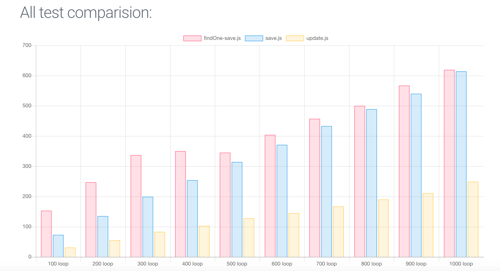

# Mongoose: Update vs FindOne and save
this is a mongoose benchmark between `find and save` and make and `update`.

## Motivation:
This test is for measure the performance impact using both methods to take a desition about how [Hiroki](https://github.com/ivanhuay/hiroki) should works.

## Hiroki Internal functionality:
In the past, some implementation of the library used the `pre-save` [method](https://mongoosejs.com/docs/middleware.html#pre) of mongoose. For keeping that working we decided to execute a `find` and after a `save`.

## Results:

Doing a `findOne` or just a `find` takes more than 2x time compared to `update` native method.

[view results HERE](https://ivanhuay.github.io/micron-mongoose-update-vs-save/)


## run the test

```
git clone https://github.com/ivanhuay/micron-mongoose-update-vs-save.git

cd micron-mongoose-update-vs-save

npm i

npm run test
```

after running that the results should be on the docs folder.
